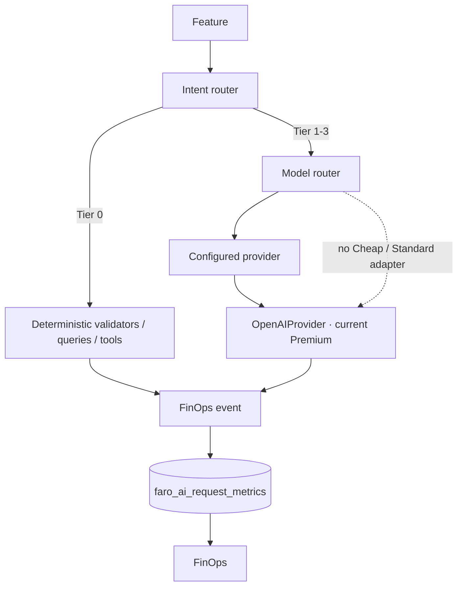

# FARO AI FinOps

FARO applies the smallest useful amount of intelligence to each request. The first production migration is intentionally incremental: Voice keeps working with OpenAI while deterministic Finance, Calendar and Backlog paths avoid an LLM whenever their parser has enough confidence.



## Current audit

| Location | Purpose | Current treatment |
| --- | --- | --- |
| `supabase/functions/faro-voice/index.ts` | Voice/text interpretation, tool selection and conversational response | Migrated to `executeFaroAI`; OpenAI remains the Premium fallback. Deterministic Finance, Calendar and Backlog fast paths run before it. |
| `supabase/functions/faro-realtime-session/index.ts` | OpenAI Realtime browser SDP session for speech transcription | Kept as an authenticated streaming pass-through and records a redacted Premium event. OpenAI does not return token usage through the SDP handshake. |
| `supabase/functions/faro-speech/index.ts` | ElevenLabs text-to-speech | Records a redacted provider/latency event with unknown cost when pricing or usage is unavailable. It is explicitly excluded from LLM routing and Premium-rate calculations. |
| `src/services/voiceService.ts` | Browser client for `faro-voice` and realtime session | No model key is exposed; it invokes Supabase Edge Functions. |
| `src/services/speechService.ts` | Browser speech playback client | Uses the authenticated `faro-speech` function only. |

There are no other production OpenAI/Anthropic/Bedrock/Nova calls in `src` or `supabase/functions` as of this migration. The OpenAI health check in `faro-voice` only validates the configured model; it is not a user inference.

## Router and tiers

The shared entry point for text-model work is `executeFaroAI` in `supabase/functions/_shared/ai/execute.ts`.

```ts
const result = await executeFaroAI({
  feature: 'voice_action_extraction',
  module: 'finance',
  intent: 'create_expense',
  preferredTier: AI_TIER.CHEAP,
  providers: [openAIProvider],
  providerTargets: [{ id: 'openai', model: 'gpt-5-mini', tier: AI_TIER.PREMIUM }],
  request: { instructions, input, tools },
})
```

- `deterministic` (Tier 0): code, rules, validated database queries and calculations. It records `avoided_llm_call = true` and zero cost is explicitly `not_applicable`.
- `cheap` (Tier 1): intended for intent classification, entity extraction and small structured work.
- `standard` (Tier 2): intended for moderate analysis and recommendations.
- `premium` (Tier 3): complex reasoning and the currently configured OpenAI model.

`routeFaroAI` is pure, so `simulateFaroAIRouting` can be used for a dry run without making an inference. This is the intended foundation for future shadow evaluation; FARO does **not** issue duplicate requests today.

Routing policy lives in `supabase/functions/_shared/ai/config.ts`. Change feature defaults there, not inside React components or individual skills. The currently configured target is OpenAI Premium. A request for Cheap or Standard therefore falls back to OpenAI and records:

```text
tierRequested: cheap | standard
tierUsed: premium
fallbackReason: provider_not_configured
escalated: true
```

## Providers

`FaroModelProvider` is the provider contract in `supabase/functions/_shared/ai/providers/provider.ts`. `OpenAIProvider` wraps the existing Responses API integration in `openAiProvider.ts`; the old Voice import path re-exports it for compatibility.

To add Nova later:

1. Create `novaProvider.ts` that implements `FaroModelProvider`.
2. Add its credentials to Supabase secrets, never to the repository.
3. Construct it in the Edge Function and pass an `AIProviderTarget` with `tier: AI_TIER.CHEAP` or `AI_TIER.STANDARD` to `executeFaroAI`.
4. Add verified pricing to the registry before displaying a monetary estimate.
5. Run `simulateFaroAIRouting` or a deliberate, opt-in shadow evaluator before enabling it for users.

No fake Nova, Anthropic or local requests are included.

## Context engine

`buildFaroContextPlan` in `supabase/functions/_shared/ai/contextEngine.ts` selects the domain before FARO queries data:

- Finance requests fetch only bounded finance accounts, categories, transactions, budgets and recurrence rows.
- Calendar/Backlog requests fetch only bounded tasks and workspaces.
- Unknown requests get compact, bounded cross-domain candidates.

The resulting `contextForRoute` sends only the selected domain to the prompt. Deterministic read/write paths continue to query their exact rows themselves. This avoids sending health, unrelated backlog, or whole conversation state into a finance request.

## Validation and Tier 0

Current deterministic candidates are the Finance, Calendar and Backlog fast paths in `financialSkill.ts`, `calendarSkill.ts`, and `backlogSkill.ts`. These cover clear reads and structured intent extraction; a fast-path result is persisted as a Tier 0 FinOps event.

Any mutation remains subject to the existing deterministic validation and confirmation flow:

```text
request → parser/model proposal → schema/authorization/duplicate checks → confirmation → tool → database
```

The model never writes to the database directly. Existing calendar authorization, safe finance delete RPCs, ownership predicates, idempotent IDs and confirmation requirements remain authoritative.

## Telemetry and pricing

Events use `public.faro_ai_request_metrics`, extended by `20260818010000_finops_ai_router.sql`. They hold operational metadata only: module, feature, intent, requested/used tiers, provider, model, token usage, latency, success/error, fallback and escalation. Prompts, transcripts and tool arguments are intentionally excluded.

After the durable Voice action log succeeds, an Edge Runtime `waitUntil` task persists the FinOps event when that runtime capability is available; local/test fallbacks await it so the metric is not silently lost.

OpenAI token usage comes from the Responses API only when returned. Missing usage stays `null`; it is never guessed. Pricing is centralized in `supabase/functions/_shared/voice/providers/pricing.ts` (`MODEL_PRICING`).

- Deterministic events: `estimated_cost_usd = 0`, `cost_status = not_applicable`.
- Known model price plus returned usage: calculated cost, `cost_status = known`.
- Missing price or usage: `estimated_cost_usd = null`, `cost_status = unknown`.

Update a price only from a verified provider price card. The UI keeps unknown cost distinct from zero.

## Persistence, budgets and FinOps UI

The migration adds an RLS-protected `faro_ai_budgets` table in the existing Supabase project. `faro_set_ai_budget` stores one monthly USD budget per user. `faro_finops_dashboard` provides aggregates and redacted inference history to the browser; it never exposes prompt content.

Open **FinOps** from the primary sidebar (`/finops`). It shows real data for today, seven days and month; tier/provider/module/feature distribution; tokens; avoided calls; Premium rate; fallbacks; errors; latency; budget; and the latest 100 inference metadata rows. The p95 latency is withheld until at least 20 latency samples exist.

## Required environment variables

Existing variables remain the only requirement for text inference:

- `OPENAI_API_KEY` (Supabase Edge Function secret)
- `OPENAI_TEXT_MODEL` (optional, defaults to `gpt-5-mini`)

Existing optional voice variables remain unchanged: `OPENAI_REALTIME_MODEL`, `OPENAI_TRANSCRIBE_MODEL`, `ELEVENLABS_API_KEY`, `ELEVENLABS_VOICE_ID`, and `ELEVENLABS_MODEL_ID`.

## Current limitations

- Cheap and Standard have no configured provider yet, so they truthfully fall back to Premium OpenAI.
- Realtime and TTS provider requests do not currently return reliable token usage; their latency metadata is separate from text-model usage.
- A deterministic request that cannot be fully resolved escalates to a model; its original fast-path outcome remains observable.
- Shadow evaluation is designed for but intentionally inactive to avoid duplicate spend.
